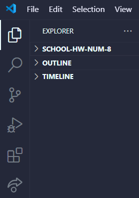
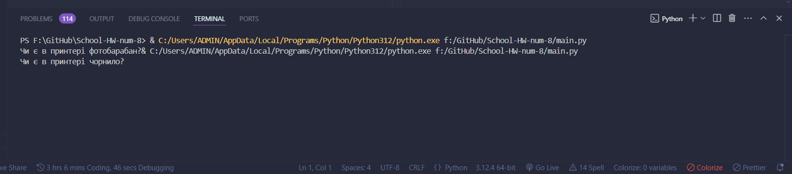

# School-HW-num-8
## Доброго вечора вчитель цей проект за 11.10 на python число нижче буде опис.
## Історія проекту
__Це просто домашнє завдання по школі, тому тут і розповідати так нічого.__
## Автор проекту
* __TheBestikk__ ([Kirill github](https://github.com/TheBestikk))
    * __Телеграм:__ https://t.me/TheBestiikkk
    * __Гмейл пошта:__ zakharovkirill357@gmail.com
### Мови та інструменти

## Тема: «Штучний інтелект. Інтернет речей»
### Задача
* Отримайте від онлайнового чат-бота (наприклад, ChatGPT) поради, як установити на свій комп’ютер IDLE Python.
* Випробуйте онлайновий чат-бот (приклад 2, с. 45), наприклад, у середовищі IDLE.
Приклад 2, с. 45. Помітивши в лісі рослину з плодами, схожими на суниці (рис. 8.3), Наталка (Н) вирішила дізнатися про незнайому рослину в онлайнового чат-бота ChatGPT (Б). Відбувся такий діалог (відповіді чат-бота скорочено):
  * Н Плід якої рослини схожий на суниці, але несмачний?
  * Б Трохи схожим на суниці, але несмачним, може бути плід рослини «лісова суниця». її плоди нагадують суничні плоди, але можуть бути менш соковитими та не такими солодкими.
  * Н А така, що її плоди не обвисають, а піднімаються вгору?
  * Б Якщо плід піднятий вгору, це може вказувати на «підлісну суницю» (лат. Potentilla erecta), також відому як «тризубець піднятий». Ця рослина насправді не належить до родини суниць (Fragaria), але її плоди подібні до суниць і також ростуть на низькому кущі.
  * Н Але «Potentilla erecta» — це латинська назва перстачу випрямленого.
  * Б Ви праві, вибачте за плутанину. Піднятий вгору плід, що нагадує суниці, але несмачний, має «перстач індійський» (лат. Potentilla indica). Це рослина, що належить до родини трояндових (Rosaceae). Її плоди нагадують плоди суниці, але зазвичай мають кислий або невиразний смак.
* Доповніть програму розпізнаванням іще двох видів принтерів: матричного (друкує за допомогою стрічки, просоченої фарбою) і термопринтера (друкує на спеціальному термочутливому папері).
## Щоб запустити проект треба:
1. Треба перейти по силці <a href="https://drive.google.com/file/d/17FnT2K9I3f2OOd3xtAuBTzHCK0-G4toI/view?usp=sharing">скачати файл</a>
2. Відкрити у редакторі кода (буде розглянений VS code  <a href="https://code.visualstudio.com/Download">силка на скачування</a>)
3. Обираєте вашу операційну систему 
4. Після скачування VS code перетягніть файл з кодом до сайд борду
5. Натисніть F5 на клавіатурі або кнопку зверху(скрін нижче) 
6. Далі відкриється віконце де треба обрати "Run Python file" 
7. Далі вже відкриється термінал де й буде працювати код 
## Відео до вправи

<iframe width="560" height="315" src="https://www.youtube.com/embed/hZ0sQ5TEqp4?si=gQA2hdECzcKbL6yD" title="YouTube video player" frameborder="0" allow="accelerometer; autoplay; clipboard-write; encrypted-media; gyroscope; picture-in-picture; web-share" referrerpolicy="strict-origin-when-cross-origin" allowfullscreen></iframe>

# __Дякую за перегляд, удачі та до скорої зустрічі!👋(дайте мені свою зірку репозиторію, будь ласка🌟 (´▽`ʃ♡ƪ) )__